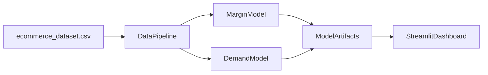

# BDA Course Project Presentation (10 Slides)

## Project Title
**Ecommerce Seller Intelligence: Margin Optimization + Demand Forecasting Dashboard**

## Team of 4 - Suggested Speaker Split
- **Member 1**: Slides 1-3 (problem, objective, dataset)
- **Member 2**: Slides 4-5 (big data pipeline, feature engineering)
- **Member 3**: Slides 6-8 (ML models, evaluation, dashboard + visualizations)
- **Member 4**: Slides 9-10 (business impact, limitations, future scope, conclusion + Q&A)

---

## Slide 1 - Problem Statement and Motivation
**Title:** Why Sellers Need Data-Driven Pricing and Demand Planning

**Content:**
- Ecommerce sellers struggle with two core questions:
  - What margin/discount should I set for maximum profit?
  - When will demand increase or decline for my products?
- Manual decisions often cause:
  - Underpricing and profit loss
  - Overpricing and low conversions
  - Poor inventory planning
- Our project solves this with ML-powered recommendations and interactive analytics.

**Speaker note:** Start with a relatable seller scenario and explain cost of wrong pricing decisions.

---

## Slide 2 - Project Objectives
**Title:** What We Built

**Content:**
- Build a machine learning system that:
  - Predicts expected margin/profit behavior
  - Predicts future demand patterns
- Build a clean dashboard for sellers to:
  - Input product and market context
  - Get margin and demand predictions
  - See trend visualizations (hot vs declining products, category demand heatmap)
- Ensure practical usability for business users (simple, fast, explainable outputs).

**Speaker note:** Emphasize this is both an analytics and product-design project.

---

## Slide 3 - Dataset and Big Data Context
**Title:** Dataset Overview and Scale

**Content:**
- Source file: `ecommerce_dataset.csv`
- Size used in project: ~**200,000 rows**
- Core fields include:
  - `OrderDate`, `ProductCategory`, `ProductName`, `Brand`
  - `UnitPrice`, `DiscountPercent`, `OrderQuantity`
  - `DeliveryDays`, `CustomerRating`, `ProfitMargin`
- Why this is BDA-relevant:
  - Multi-dimensional transactional data
  - Large-scale preprocessing + feature transformation
  - Predictive analytics for business decisions

**Speaker note:** Briefly connect to “volume + variety + value”.

---

## Slide 4 - End-to-End System Architecture
**Title:** Pipeline from Raw Data to Decision Support

**Content (flow):**
1. Raw CSV ingestion
2. Data cleaning + feature engineering
3. Model training (margin model + demand model)
4. Artifact storage (`joblib` models, metrics, trend tables)
5. Streamlit dashboard inference + visualization

**Mermaid diagram (optional for slide):**

**Speaker note:** Highlight separation of training and inference phases.

---

## Slide 5 - Data Preprocessing and Feature Engineering
**Title:** How Raw Data Became Model-Ready

**Content:**
- Parsed `OrderDate` into:
  - Month, day-of-week, quarter, weekend flag
- Cleaned and constrained noisy fields:
  - Discount clipping, margin clipping, delivery-day bounds
- Created derived business features:
  - Final unit price after discount
  - Realized profit estimates
  - Estimated unit cost proxies
- Categorical handling:
  - Encoded company/category/product/brand/location/payment/status features

**Speaker note:** Mention that good feature engineering drives most of the model value.

---

## Slide 6 - Machine Learning Models
**Title:** Predictive Models and Optimization Logic

**Content:**
- **Model 1 (Primary):** Margin behavior prediction
- **Model 2 (Secondary):** Demand prediction (`OrderQuantity`)
- Regression pipeline with preprocessing + tree-based model
- Profit optimization strategy:
  - Evaluate multiple discount points
  - Predict margin + demand for each scenario
  - Select discount with maximum expected profit

**Formula used in recommendation:**
`Expected Profit = Predicted Demand x Discounted Unit Price x Predicted Margin%`

**Speaker note:** Explain that recommendation is from simulation over candidate pricing options.

---

## Slide 7 - Evaluation and Model Performance
**Title:** Metrics and Validation

**Content:**
- Time-aware train/validation split (more realistic than random split)
- Metrics tracked:
  - MAE, RMSE, R²
- Example observations from runs:
  - Demand MAE around ~1.57 units
  - Margin MAE around ~6.26 percentage points
- Interpretation:
  - Model gives directional decision support
  - Best used for recommendation + comparative scenarios, not absolute certainty

**Speaker note:** Be transparent: accuracy is moderate, but business utility is high for decision support.

---

## Slide 8 - Dashboard and Visual Analytics
**Title:** Seller-Facing UI (Apple-Style Clean Design)

**Content:**
- Minimal interface with clear cards and focused controls
- Key outputs shown to seller:
  - Recommended discount
  - Predicted margin
  - Predicted demand
  - Expected profit
- Visualizations implemented:
  - Pricing frontier (discount vs expected profit)
  - Hot products (rising demand)
  - Declining products
  - Category-month demand heatmap
  - Top demand states
  - Delivery speed vs demand relation

**Speaker note:** Show quick live demo or screenshots during this slide.

---

## Slide 9 - Business Impact, Limitations, and Ethics
**Title:** Real-World Value and Critical Discussion

**Content:**
- Business value:
  - Better pricing decisions
  - Better demand planning and inventory alignment
  - Faster decision cycles via self-serve dashboard
- Current limitations:
  - Synthetic/noisy data patterns can limit predictive power
  - No external signals (seasonality events, competitor pricing, ad spend)
  - Recommendation confidence can vary by product segment
- Responsible use:
  - Keep human oversight for final decisions
  - Avoid over-reliance on single-model output

**Speaker note:** Faculty usually values this critical reflection.

---

## Slide 10 - Conclusion, Future Scope, and Q&A
**Title:** Key Takeaways and Next Steps

**Content:**
- We delivered an end-to-end BDA solution:
  - Big data preprocessing
  - ML-based demand + margin intelligence
  - Interactive analytics dashboard for decision-making
- Future enhancements:
  - Add time-series specific forecasting models
  - Add competitor and campaign data
  - Add confidence intervals and model explainability (SHAP)
  - Deploy as cloud service with API + role-based access
- Final message:
  - Data-driven pricing and demand planning can significantly improve seller profitability.
- **Q&A**

**Speaker note:** End with one strong impact statement and invite questions.

---

## Optional Appendix Slide Ideas (if faculty asks extra)
- Tech stack (`Python`, `pandas`, `scikit-learn`, `Streamlit`, `Plotly`)
- Demo steps (train -> run app -> test scenarios)
- Repository structure and reproducibility instructions
